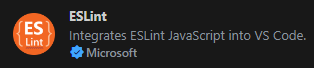

# React V8 Template

This is a simple React V8 Template to start a new project.

## Installation

```bash
npm run install
```

## VSCode Extensions

the project includes a prettier & eslint configuration, so the recommended extensions are




## Running

To run the server on your local machine, run

```bash
npm run dev
```

To build the project, run

```bash
npm run build
```

To have a preview of the production build, run

```bash
npm run preview
```

## License

[MIT](https://choosealicense.com/licenses/mit/)
